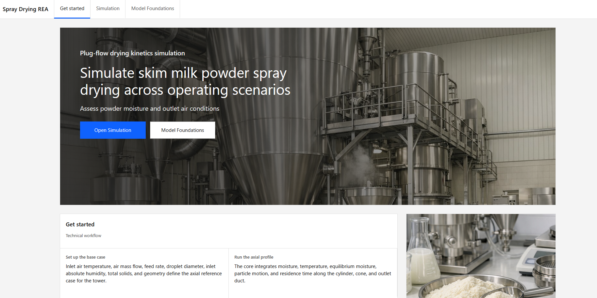
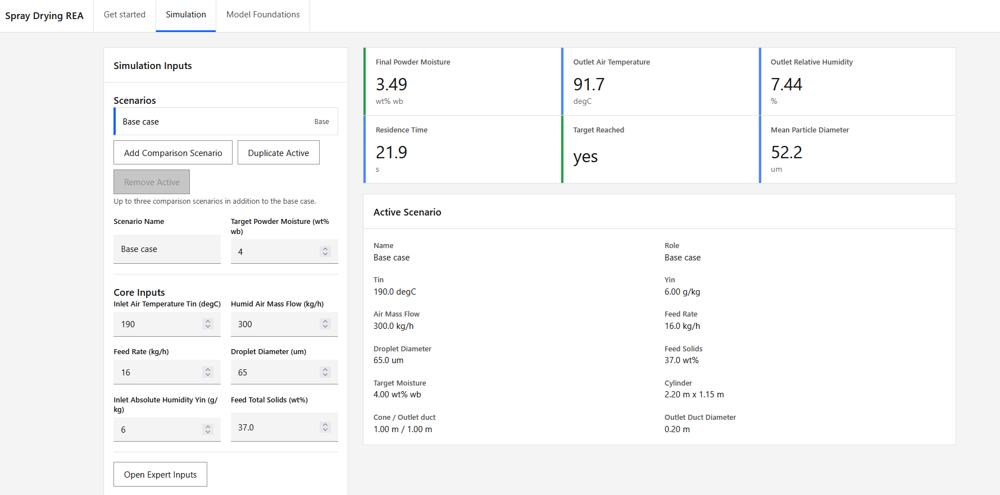
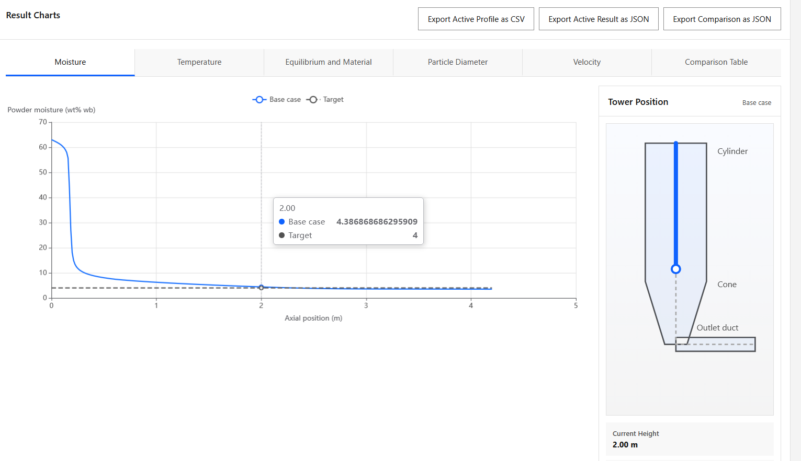

# Spray Drying REA

Web app for evaluating steady-state spray drying of skim milk powder with a Reaction Engineering Approach (REA) core. The active application consists of a React frontend, a FastAPI backend, and the stationary SMP model in `core/stationary_smp_rea/`.

## Features

- Home page with direct entry into the simulator and model foundations.
- Scenario-based simulation for skim milk powder spray drying.
- Base case plus up to three comparison scenarios.
- Core input set for inlet air conditions, feed rate, droplet diameter, feed solids, and segmented dryer geometry.
- Expert inputs for equilibrium moisture model selection, nozzle parameters, heat loss, and geometry details.
- KPI summary for final powder moisture, outlet air temperature, outlet relative humidity, residence time, target attainment, and mean particle diameter.
- Axial charts for moisture, temperature, equilibrium moisture, particle diameter, velocity, and KPI comparison.
- Tower preview linked to the active axial chart position.
- Model foundations page with process steps, governing equations, sources, and model limits.

## App Preview

### Get Started



### Simulation Inputs



### Result Charts



## Active Runtime Layout

The active web app uses only these paths at runtime:

- `src/spray_drying/`
- `frontend/`
- `core/stationary_smp_rea/`

Legacy Streamlit code, process simulation, and calibration tooling were moved to `legacy/` and are no longer part of the active Docker image or the active Python runtime requirements.

## Requirements

- Git
- Python 3.12 or a compatible Python 3 version
- Node.js and npm
- Optional: Docker and Docker Compose for the fastest local setup

## Quick Start With Docker

Clone the repository and change into the project directory:

```bash
git clone https://github.com/Franky-11/spray-drying-rea.git
cd spray-drying
```

Build and start the container:

```bash
docker compose up --build
```

The full app is then available at:

```text
http://localhost:8000
```

Stop containers:

```bash
docker compose stop
```

Stop and remove containers:

```bash
docker compose down
```

## Manual Installation

Clone the repository and change into the project directory:

```bash
git clone https://github.com/Franky-11/spray-drying-rea.git
cd spray-drying
```

Create a Python environment for the backend and install active runtime dependencies:

```bash
python -m venv .venv
source .venv/bin/activate
pip install -r requirements.txt
```

On Windows:

```powershell
python -m venv .venv
.\.venv\Scripts\Activate.ps1
pip install -r requirements.txt
```

Install frontend dependencies and build the frontend:

```bash
cd frontend
npm install
npm run build
cd ..
```

## Run Locally Without Docker

For normal local use, a single server is sufficient. FastAPI serves the built frontend from `frontend/dist/` in addition to the API endpoints.

Start from the repo root:

```bash
source .venv/bin/activate
PYTHONPATH=src:. uvicorn spray_drying.api:app --host 0.0.0.0 --port 8000
```

On Windows:

```powershell
.\.venv\Scripts\Activate.ps1
$env:PYTHONPATH = "src;."
uvicorn spray_drying.api:app --host 0.0.0.0 --port 8000
```

The full app is then available at:

```text
http://localhost:8000
```

React routes fall back to `frontend/dist/index.html`.

## Development Mode With Vite

For UI development, the frontend can run separately with Vite hot reload.

Start the backend from the repo root:

```bash
source .venv/bin/activate
PYTHONPATH=src:. uvicorn spray_drying.api:app --reload
```

Start the frontend in a second terminal:

```bash
cd frontend
npm run dev
```

The frontend is then available at:

```text
http://localhost:5173
```

The Vite dev server proxies API requests to `http://127.0.0.1:8000`.

## Usage

1. Open the app and choose `Open Simulation` on the home screen.
2. Start from the base case and inspect the default SMP operating point.
3. Adjust inlet air temperature, air mass flow, feed rate, droplet diameter, inlet humidity, feed solids, and target powder moisture.
4. Optionally open `Expert Inputs` to change the equilibrium moisture model, nozzle parameters, heat loss, and segmented geometry.
5. Add comparison scenarios if operating sensitivities should be evaluated against the base case.
6. Run `Run Comparison`.
7. Review KPIs, axial profiles, warnings, and the tower position preview.
8. Open `Model Foundations` to inspect the process workflow, equations, sources, assumptions, and limits.

## Model Scope and Limits

- The current app targets steady-state SMP spray drying with an REA-based axial core.
- Equilibrium moisture is available through the temperature-dependent GAB closure and the Langrish isotherm option.
- Segmented geometry is treated as an effective 1D flow path consisting of cylinder, cone, and outlet duct.
- The model evaluates outlet air conditions, powder moisture, residence time, and mean particle diameter at the pre-cyclone outlet location.
- Warnings are emitted when inputs move outside the main calibration or design window, for example for inlet air temperature or low-solids shrinkage use.
- The current V1 app does not include a Tg or stickiness risk model.

## Tests and Checks

Install active test dependencies:

```bash
pip install -r requirements.txt -r requirements-dev.txt
```

Backend API and stationary-core tests:

```bash
source .venv/bin/activate
python -m unittest tests.test_api tests.test_stationary_smp_rea -v
```

Frontend lint and build:

```bash
cd frontend
npm run lint
npm run build
```

Docker image build:

```bash
docker build -t spray-drying-rea .
```

## Legacy Tooling

Archived Streamlit UI, process simulation, and calibration tooling live under `legacy/`.

To work with the archived code paths:

```bash
pip install -r requirements.txt -r requirements-dev.txt -r requirements-legacy.txt
```

See `legacy/README.md` for the archived layout.

## Repository Contents

- `src/spray_drying/`: FastAPI app, API schemas, and service layer
- `core/stationary_smp_rea/`: active stationary SMP REA core
- `frontend/`: React/Vite/TypeScript frontend
- `tests/`: active API and stationary-core tests
- `legacy/`: archived Streamlit app, process simulation, calibration code, and legacy tests
- `ms400/`: reference and calibration data retained for validation and archived workflows
